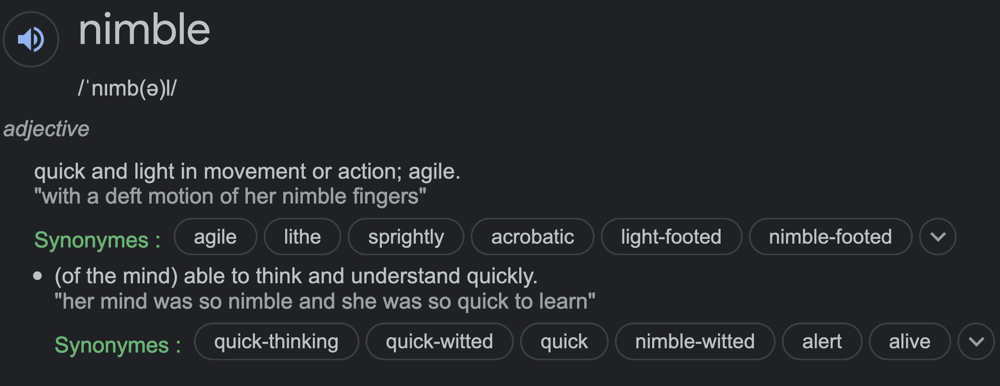
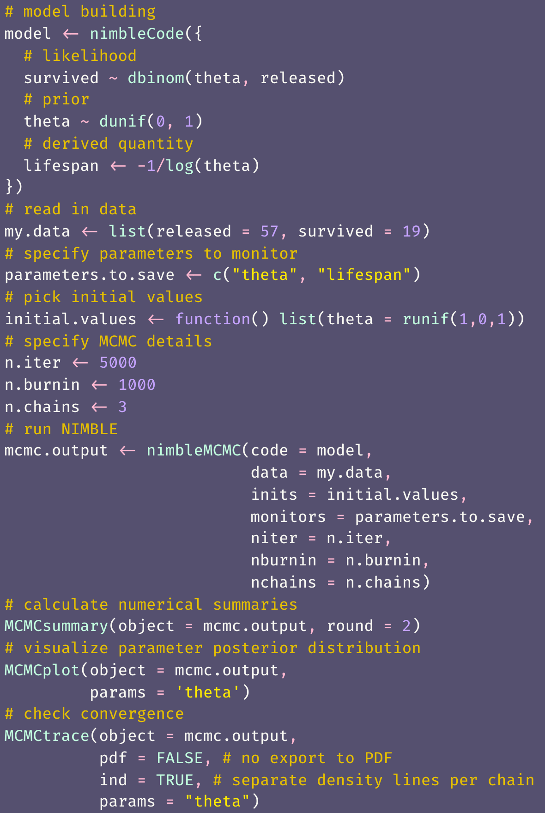
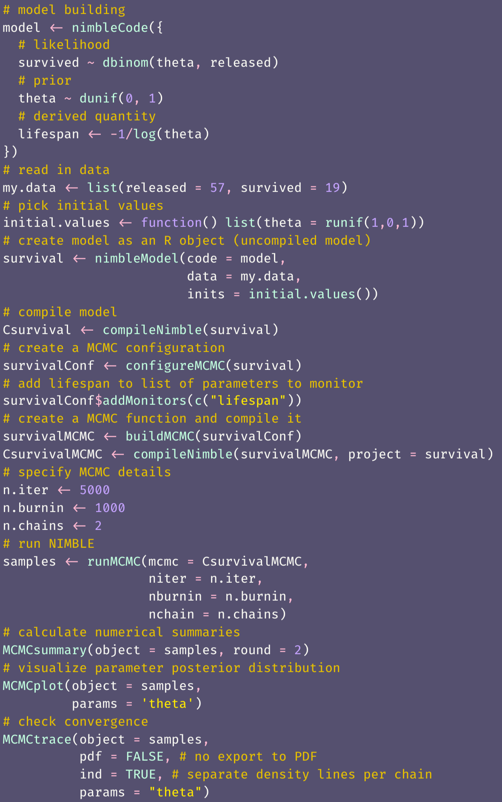

```{r setup, include=FALSE, echo=FALSE, massage = FALSE, warning=FALSE}
options(htmltools.dir.version = FALSE)
knitr::opts_chunk$set(comment = "")

library(tidyverse)
theme_set(theme_light())
update_geom_defaults("point", list(size = 2)) 
library(here)
library(nimble)
```

# What is NIMBLE?

```{r nimblelogo, echo = FALSE, fig.align="center", out.width="50%"}
knitr::include_graphics("img/nimble-icon.png")
```

---

```{r nimbledef, echo = FALSE, fig.align="center", out.width="80%"}

```

---
# What is NIMBLE?

--

+ **N**umerical **I**nference for statistical **M**odels using **B**ayesian and **L**ikelihood **E**stimation.

--

+ A framework for statistical models and algorithms. 

--

+ Uses almost same model syntax as WinBUGS, OpenBUGS, and JAGS, with C++ in the background for faster computations.

--

+ Extension of BUGS language: Additional syntax, call to existing R functions, and implementation of your own functions/distributions. 

--

+ Flexibility in MCMC samplers config: Change defaults, write your own algorithms. 

--

+ A library of other methods (SMC, MCEM).

???

+ Sequential Monte Carlo (particle filtering)
+ Monte Carlo Expectation Maximization (maximum likelihood)

--

+ A team of friendly, active and helpful developers: de Valpine, Paciorek, Turek.

---
# This workshop

+ Getting started with NIMBLE

+ Programming and coding functions/distributions

+ Choosing and coding MCMC samplers

---
# Example

Say we capture, mark and release $n = 57$ animals at the beginning of a winter, out of which we recapture $y = 19$ animals alive:
```{r}
y <- 19 # nb of success
n <- 57 # nb of attempts
```

Assuming all animals are independent of each other and have the same survival probability $\theta$, then $y$ the number of alive animals at the end of the winter is binomial. Using a uniform prior for survival, we have:

\begin{align*}
   y &\sim \text{Binomial}(n, \theta) &\text{[likelihood]}
   \\
  \theta &\sim \text{Uniform}(0, 1) &\text{[prior for }\theta \text{]} \\
\end{align*}

We'd like to estimate winter survival $\theta$.

---
# NIMBLE workflow

To run NIMBLE, you will need to:  

1. Build a model consisting of a likelihood and priors.   

2. Read in some data.   

3. Specify parameters you want to make inference about.   

4. Pick initial values for parameters to be estimated (for each chain).   

5. Provide MCMC details namely the number of chains, the length of the burn-in period and the number of iterations following burn-in.

---
## Load `nimble` package

First things first:
```{r}
library(nimble)
```

---
class: center, middle

# Getting started

---
# 1. Build model

+ Specify binomial likelihood and uniform prior on survival probability `theta`. 

+ We use the `nimbleCode()` function and wrap code within curly brackets:

```{r}
model <- nimbleCode({
  # likelihood
  survived ~ dbinom(theta, released)
  # prior
  theta ~ dunif(0, 1)
  # derived quantity
  lifespan <- -1/log(theta) # expected lifespan 
                            # w/ constant survival
})
```

+ It does not matter in what order you write each line of code, NIMBLE uses a declarative language (vs imperative language).

---
# 1. Build model

You can check that the `model` R object contains your code:
```{r}
model
```

---
# 1. Build model

+ The most common distributions are available in NIMBLE. 

+ Among others, `dunif`, `dbeta`, `dmultinom` and `dnorm`. 

+ If you cannot find what you need in NIMBLE, you can write your own distribution (more soon).

---
# 2. Read in data

We use a list in which each component corresponds to a known quantity in the model:
```{r}
my.data <- list(released = 57, survived = 19)
```

---
# 2. Distinguish constants and data

+ NIMBLE distinguishes data and constants. 

+ Constants are values that do not change, e.g. vectors of known index values or the indices used to define for loops. 

+ Data are values that you might want to change, basically anything that only appears on the left of a `~`.

+ For computational efficiency, better to specify as much as possible as constants.

```{r eval = FALSE}
my.constants <- list(released = 57)
my.data <- list(survived = 19)
```

+ Nimble will help you with this!

---
# 3. Specify parameters

+ In our model, we want survival `theta` and `lifespan`:

```{r}
parameters.to.save <- c("theta", "lifespan")
```

+ In general you have many quantities in your model, including some of little interest that are not worth monitoring, and having full control on verbosity will prove handy.

---
# 4. Pick initial values

You can specify initial values for each chain in a list and put them in yet another list:
```{r}
init1 <- list(theta = 0.1)
init2 <- list(theta = 0.5)
initial.values <- list(init1, init2)
initial.values
```

---
# 4. Pick initial values 

Alternatively, you can write a simple R function that generates random initial values:
```{r}
initial.values <- function() list(theta = runif(1,0,1))
initial.values()
```

---
# 5. Provide MCMC details

+ You need to tell NIMBLE:
      + The number of chains to run, say `n.chain`
      + How long the burn-in period should be, say `n.burnin`
      + The total number of iterations, say `n.iter`
      
+ In NIMBLE, the number of posterior samples per chain is `n.iter - n.burnin` 

```{r}
n.iter <- 5000
n.burnin <- 1000
n.chains <- 2
```

---
class: center, middle

# Run NIMBLE

---
# Run NIMBLE

+ We now sample in the posterior distribution of model parameters using MCMC simulations. 

+ This is accomplished using function `nimbleMCMC()`: 
```{r, warning=FALSE, message=FALSE, eval = FALSE}
mcmc.output <- nimbleMCMC(code = model,
                          data = my.data,
                          inits = initial.values,
                          monitors = parameters.to.save,
                          niter = n.iter,
                          nburnin = n.burnin,
                          nchains = n.chains)
```

```{r, cache = TRUE, echo = FALSE, warning = FALSE, message=FALSE}
mcmc.output <- nimbleMCMC(code = model,
                          data = my.data,
                          inits = initial.values,
                          monitors = parameters.to.save,
                          niter = n.iter,
                          nburnin = n.burnin,
                          nchains = n.chains,
                          progressBar = FALSE)
```

---
class: center, middle

# Inspect outputs

---
# Structure

+ Now let's inspect what we have in `mcmc.output`: 

```{r}
str(mcmc.output)
```

+ The R object `mcmc.output` is a list with two components, one for each MCMC chain. 

---
# Dimensions

```{r}
dim(mcmc.output$chain1)
```

---
# Return values

```{r}
head(mcmc.output$chain1)
```

---
# Compute posterior summaries

You can compute the posterior mean of `theta`:
```{r}
mean(mcmc.output$chain1[,'theta'])
```

You can also obtain the 95% credible interval for `theta`:
```{r}
quantile(mcmc.output$chain1[,'theta'], probs = c(2.5, 97.5)/100)
```

---
## Visualize posterior distribution with a histogram

.center.nogap[
```{r, echo = FALSE, fig.width = 7.5, fig.asp = 0.618, dev = "svg", message=FALSE, warning=FALSE}
mcmc.output %>%
  as_tibble() %>%
  ggplot() + 
  geom_histogram(aes(x = chain1[,"theta"]), color = "white") + 
  labs(x = "survival probability")
```
]

---
## R code to produce histogram

```{r, eval = FALSE, fig.width = 7.5, fig.asp = 0.618, dev = "svg", message=FALSE, warning=FALSE}
mcmc.output %>%
  as_tibble() %>%
  ggplot() + 
  geom_histogram(aes(x = chain1[,"theta"]), color = "white") + 
  labs(x = "survival probability")
```

---
# Painless ways of doing posterior inference

+ The R package `MCMCvis` can be used to summarise and visualize MCMC outputs. 

+ There are other perfectly valid options out there like `ggmcmc` and `basicMCMCplots`. 

+ Let's load the package `MCMCvis`:

```{r}
library(MCMCvis)
```

---
# Numerical summaries

To get common numerical summaries, function `MCMCsummary()` does the job:
```{r}
MCMCsummary(object = mcmc.output, round = 2)
```

---
# Visualize

A caterpillar plot to visualise posterior distribution of `theta` with `MCMCplot()`:
```{r, eval = FALSE}
MCMCplot(object = mcmc.output, params = 'theta')
```

---
# Visualize

A caterpillar plot to visualise posterior distribution of `theta` with `MCMCplot()`:
.center.nogap[
```{r, echo = FALSE, fig.width = 7.5, fig.asp = 0.618, dev = "svg", message=FALSE, warning=FALSE}
MCMCplot(object = mcmc.output, 
         params = 'theta')
```
]

---
# Trace and posterior density

The trace and posterior density of theta can be obtained with `MCMCtrace()`:
```{r, eval = FALSE, fig.width = 7.5, fig.asp = 0.618, dev = "svg", message=FALSE, warning=FALSE}
MCMCtrace(object = mcmc.output,
          pdf = FALSE, # no export to PDF
          ind = TRUE, # separate density lines per chain
          params = "theta")
```

---
# Trace and posterior density

The trace and posterior density of theta can be obtained with `MCMCtrace()`:
.center.nogap[
```{r, echo = FALSE, fig.width = 7.5, fig.asp = 0.618, dev = "svg", message=FALSE, warning=FALSE}
MCMCtrace(object = mcmc.output,
          pdf = FALSE, # no export to PDF
          ind = TRUE, # separate density lines per chain
          params = "theta")
```
]

---
# Diagnostics of convergence

You can also add diagnostics of convergence:
```{r, eval = FALSE}
MCMCtrace(object = mcmc.output,
          pdf = FALSE,
          ind = TRUE,
          Rhat = TRUE, # add Rhat
          n.eff = TRUE, # add eff sample size
          params = "theta")
```

---
# Diagnostics of convergence

You can also add diagnostics of convergence:
.center.nogap[
```{r, echo = FALSE, fig.width = 7.5, fig.asp = 0.618, dev = "svg", message=FALSE, warning=FALSE}
MCMCtrace(object = mcmc.output,
          pdf = FALSE,
          ind = TRUE,
          Rhat = TRUE, # add Rhat
          n.eff = TRUE, # add eff sample size
          params = "theta")
```
]

---
class: center, middle

# Derived quantities

---
# Compute lifespan (1)

+ We calculated lifespan directly in our model with `lifespan <- -1/log(theta)`. 

+ But you can also calculate this quantity from outside NIMBLE. 

+ In our example, all you need is samples from the posterior distribution of `theta`, which we pool between the three chains with:

```{r}
theta_samples <- c(mcmc.output$chain1[,'theta'], 
                   mcmc.output$chain2[,'theta'],
                   mcmc.output$chain3[,'theta'])
```

---
# Compute lifespan (2)

+ To get samples from the posterior distribution of lifespan, we apply the function to calculate lifespan to the samples from the posterior distribution of survival:
```{r}
lifespan <- -1/log(theta_samples)
```

---
# Numerical summaries

Then, as usual, you can calculate posterior mean and 95% credible interval:
```{r}
mean(lifespan)
quantile(lifespan, probs = c(2.5, 97.5)/100)
```

---
# Visualize

You can also visualise the posterior distribution of lifespan:
```{r, eval = FALSE}
lifespan %>%
  as_tibble() %>%
  ggplot() +
  geom_histogram(aes(x = value), color = "white") +
  labs(x = "lifespan")
```

---
# Visualize

.center.nogap[
```{r, echo = FALSE, fig.width = 7.5, fig.asp = 0.618, dev = "svg", message=FALSE, warning=FALSE}
lifespan %>%
  as_tibble() %>%
  ggplot() +
  geom_histogram(aes(x = value), color = "white") +
  labs(x = "lifespan")
```
]

---
```{r simple-workflow, echo = FALSE, fig.align="center", out.width="40%"}

```


---
class: center, middle

## NIMBLE is more than just another MCMC engine

---
# NIMBLE is a programming environment

+ Allows full control when building models and estimating parameters. 

+ Allows you to write your own functions and distributions to build models, and to choose alternative MCMC samplers or code new ones.

+ Here, we're gonna tell you more about programming, and show you a NIMBLE detailed workflow.

---
class: middle center
background-color: black


---
class: center, middle

# Programming: NIMBLE functions

---
# NIMBLE functions

+ NIMBLE provides `nimbleFunctions` for programming. 

+ A `nimbleFunction` is like an R function, which can be compiled for faster computation. 

---
# Example

+ Going back to our animal survival example, we can write a `nimbleFunction` to compute lifespan:
```{r}
computeLifespan <- nimbleFunction(
    run = function(theta = double(0)) { # type declarations
        ans <- -1/log(theta)
        return(ans)
        returnType(double(0))  # return type declaration
    } )
```

---
# Example

+ The `run` section gives the function to be executed. It is written in the NIMBLE language. 

+ The `theta = double(0)` and `returnType(double(0))` arguments tell NIMBLE that the input and output are single numeric values (scalars). 

+ Alternatively, `double(1)` and `double(2)` are for vectors and matrices, while `logical()`, `integer()` and `character()` are for logical, integer and character values. 

---
# Example

You can use your `nimbleFunction` in R:
```{r}
computeLifespan(0.8)
```

You can compile it and use the C++ code for faster computation: 
```{r message = FALSE, warning=FALSE}
CcomputeLifespan <- compileNimble(computeLifespan)
CcomputeLifespan(0.8)
```

---
# Example

You can also use your `nimbleFunction` in a model:
```{r}
model <- nimbleCode({
  # likelihood
  survived ~ dbinom(theta, released)
  # prior
  theta ~ dunif(0, 1)
  # derived quantity
  lifespan <- computeLifespan(theta)
})
```

---
## The rest of the workflow remains the same

<style type="text/css">

pre {
  font-size: 22px
}
</style>

```{r eval = FALSE}
my.data <- list(survived = 19, released = 57)
parameters.to.save <- c("theta", "lifespan")
initial.values <- function() list(theta = runif(1,0,1))
n.iter <- 5000
n.burnin <- 1000
n.chains <- 2
mcmc.output <- nimbleMCMC(code = model,
                          data = my.data,
                          inits = initial.values,
                          monitors = parameters.to.save,
                          niter = n.iter,
                          nburnin = n.burnin,
                          nchains = n.chains)
MCMCsummary(object = mcmc.output, round = 2)
```

---
# More about nimbleFunctions

+ With `nimbleFunctions`, you can mimic basic R syntax, do linear algebra (e.g. compute eigenvalues), operate on vectors and matrices (e.g. inverse a matrix), use logical operators (e.g. and/or) and flow control (e.g. if-else). 

+ There is also a long list of common and less common distributions that can be used with `nimbleFunctions`. 

+ To learn everything you need to know on writing `nimbleFunctions`, make sure to read chapter 11 of the NIMBLE manual at <https://r-nimble.org/html_manual/cha-RCfunctions.html#cha-RCfunctions>. 

---
class: center, middle

# Programming: Calling R/C++ functions

---
# Calling R/C++ functions

+ If you're like us, and too lazy to write your own functions, you can rely on the scientific community and use existing C, C++ or R code. 

+ The trick is to write a `nimbleFunction` that wraps access to that code which can then be used by NIMBLE. 

---
# R function example

+ As an example, imagine you'd like to use an R function `myfunction()`, either a function you wrote yourself, or a function available in your favorite R package:
```{r}
myfunction <- function(x) {
  -1/log(x)
}
```

---
# R function example

Just wrap this function using `nimbleRcall()` (`nimbleExternalCall()` for a C/C++ function):
```{r}
Rmyfunction <- 
  nimbleRcall(prototype = function(x = double(0)){}, 
                           Rfun = 'myfunction',
                           returnType = double(0))
```

In the call to `nimbleRcall()` above, the argument `prototype` specifies inputs (a single numeric value `double(0)`) of the R function `Rfun` that generates outputs `returnType` (a single numeric value `double(0)`).  

---
# R function example

Now you can call your R function from a model (or any `nimbleFunctions`):
```{r}
model <- nimbleCode({
  # likelihood
  survived ~ dbinom(theta, released)
  # prior
  theta ~ dunif(0, 1)
  lifespan <- Rmyfunction(theta)
})
```

---
## The rest of the workflow remains the same

<style type="text/css">

pre {
  font-size: 22px
}
</style>

```{r eval = FALSE}
my.data <- list(survived = 19, released = 57)
parameters.to.save <- c("theta", "lifespan")
initial.values <- function() list(theta = runif(1,0,1))
n.iter <- 5000
n.burnin <- 1000
n.chains <- 2
mcmc.output <- nimbleMCMC(code = model,
                          data = my.data,
                          inits = initial.values,
                          monitors = parameters.to.save,
                          niter = n.iter,
                          nburnin = n.burnin,
                          nchains = n.chains)
MCMCsummary(object = mcmc.output, round = 2)
```

---
# Calling external R/C++ functions

+ Evaluating an R function from within NIMBLE slows MCMC sampling down.

+ But if you can live with it, the cost is easily offset by the convenience of being able to use existing R functions. 

+ Another advantage of using `nimbleRcall()` (or `nimbleExternalCall()`) is that you can keep large objects out of your model, so that NIMBLE does not have to handle them in MCMC sampling. 

+ These objects should be constants and not change when you run NIMBLE. 

+ Letting R manipulating these objects will save you time, usually more than the time you lose by calling R from within NIMBLE.

---
class: center, middle

# Programming: User-defined distributions

---
# User-defined distributions

+ With `nimbleFunctions` you can provide user-defined distributions to NIMBLE. 

+ You need to write functions for density (`d`) and simulation (`r`) for your distribution. 

---
## Let's write our own binomial distribution: density

```{r}
# density
dmybinom <- nimbleFunction(
  run = function(x = double(0), 
                 size = double(0), 
                 prob = double(0), 
                 log = integer(0, default = 1)) {
    returnType(double(0))
    # compute binomial coefficient 
    lchoose <- lfactorial(size) - lfactorial(x) - lfactorial(size - x)
    # binomial density function
    logProb <- lchoose + x * log(prob) + (size - x) * log(1 - prob)
    if(log) return(logProb)
    else return(exp(logProb)) 
  })
```

---
## Let's write our own binomial distribution: simulation

```{r}
# simulation using the coin flip method (p. 524 in Devroye 1986)
rmybinom <- nimbleFunction(
  run = function(n = integer(0, default = 1),
                 size = double(0),
                 prob = double(0)) {
    returnType(double(0))
    x <- 0
    y <- runif(n = size, min = 0, max = 1)
    for (j in 1:size){
      if (y[j] < prob){
        x <- x + 1
      }else{
        x <- x
      }
    }
    return(x)    
  })
```

---
# Example

You need to define the `nimbleFunctions` in R's global environment for them to be accessed: 
```{r}
assign('dmybinom', dmybinom, .GlobalEnv)
assign('rmybinom', rmybinom, .GlobalEnv)
```

---
# Try your functions out

You can try out your function and simulate a random value from a binomial distribution with size 5 and probability 0.1: 
```{r}
rmybinom(n = 1, size = 5, prob = 0.1)
```

Again with probability 0.8:
```{r}
rmybinom(n = 1, size = 5, prob = 0.8)
```

---
### All set. You can proceed with your usual workflow now.

```{r eval = FALSE}
model <- nimbleCode({
 # likelihood
 survived ~ dmybinom(prob = theta, size = released)
 # prior
 theta ~ dunif(0, 1)
})
...
mcmc.output <- nimbleMCMC(code = model,
 data = my.data,
 inits = initial.values,
 niter = n.iter,
 nburnin = n.burnin,
 nchains = n.chains)
MCMCsummary(mcmc.output)
```

---
class: center, middle

# Detailed NIMBLE workflow

---
# Under the hood

+ So far, we have used `nimbleMCMC()` which runs the default MCMC workflow. 

+ This is perfecly fine for most applications. 

+ However, in some situations you need to customize the MCMC samplers to improve or fasten convergence.

+ NIMBLE allows you to look under the hood by using a detailed workflow in several steps: `nimbleModel()`, `configureMCMC()`, `buildMCMC()`, `compileNimble()` and `runMCMC()`. 

+ Note that `nimbleMCMC()` does all of this at once.

---
# NIMBLE detailed workflow

We write the model code, read in data and pick initial values as before:
```{r}
model <- nimbleCode({
  # likelihood
  survived ~ dbinom(theta, released)
  # prior
  theta ~ dunif(0, 1)
  # derived quantity
  lifespan <- -1/log(theta)
})
my.data <- list(survived = 19, released = 57)
initial.values <- list(theta = 0.5)
```

---
# 1. Create the model as an R object

First step is to create the model as an R object (uncompiled model) with `nimbleModel()`:
```{r message=FALSE, warning=FALSE}
survival <- nimbleModel(code = model,
                        data = my.data,
                        inits = initial.values)
```

---
# 1. Create the model as an R object

You can look at its components (or nodes):
```{r}
survival$getNodeNames()
```

---
# 1. Create the model as an R object

You can look at the values stored at each node:
```{r}
survival$theta
survival$survived
survival$lifespan 
# this is -1/log(0.5)
```

---
# 1. Create the model as an R object

We can also calculate the log-likelihood at the initial value for `theta`:
```{r}
survival$calculate()
# this is dbinom(x = 19, size = 57, prob = 0.5, log = TRUE)
```

The ability in NIMBLE to access the nodes of your model and to evaluate the model likelihood can help you in identifying bugs in your code (not covered here). 

---
# 2. Compile model

We compile the model with `compileNimble()`:
```{r message=FALSE, warning=FALSE}
Csurvival <- compileNimble(survival)
```

With `compileNimble()`, the C++ code is generated, compiled and loaded back into R so that it can be used in R (compiled model):
```{r}
Csurvival$theta
```

---
## NIMBLE can do maximum likelihood estimation

+ Now you have two versions of the model, `survival` is in R and `Csurvival` in C++. 

+ Being able to separate the steps of model building and parameter estimation is a strength of NIMBLE. 

+ This gives you a lot of flexibility at both steps. 

+ For example, imagine you would like to fit your model with maximum likelihood. You can do it by wrapping your model in an R function that gets the likelihood and maximise this function. 

---
## NIMBLE can do maximum likelihood estimation

Using the C version of the model, you can write:
```{r}
# function for negative log-likelihood to minimize
f <- function(par) {
    Csurvival[['theta']] <- par # assign par to theta 
    ll <- Csurvival$calculate() # update log-likelihood with par value
    return(-ll) # return negative log-likelihood
}
```

---
## NIMBLE can do maximum likelihood estimation

```{r}
# evaluate function at 0.5 and 0.9
f(0.5)
f(0.9)
```

---
## NIMBLE can do maximum likelihood estimation

```{r}
# minimize function
out <- optimize(f, interval = c(0,1))
round(out$minimum, 2)
```

By maximising the likelihood (or minimising the negative log-likelihood), you obtain the maximum likelihood estimate of animal survival, which is exactly 19 surviving animals over 57 released animals or `r round(19/57, 2)`.

---
# 3. MCMC configuration

We create a MCMC configuration for our model with `configureMCMC()`:
```{r}
survivalConf <- configureMCMC(survival)
```

+ This steps tells you the nodes that are monitored by default, and the MCMC samplers than have been assigned to them. 

+ Here `theta` is monitored, and samples from its posterior distribution are simulated with a random walk sampler.


---
# 3. MCMC configuration

To monitor `lifespan` in addition to `theta`, you write:
```{r}
survivalConf$addMonitors(c("lifespan"))
survivalConf
```

---
# 4. Create MCMC function

+ We create a MCMC function with `buildMCMC()` and compile it with `compileNimble()`:

```{r message=FALSE, warning=FALSE}
survivalMCMC <- buildMCMC(survivalConf)
CsurvivalMCMC <- compileNimble(survivalMCMC, project = survival)
```

+ Note that models and `nimbleFunctions` need to be compiled before they can be used to specify a project.

---
# 5. Run NIMBLE

We run NIMBLE with `runMCMC()`:
```{r message=FALSE, warning=FALSE}
n.iter <- 5000
n.burnin <- 1000
samples <- runMCMC(mcmc = CsurvivalMCMC, 
                   niter = n.iter,
                   nburnin = n.burnin)
```

---
# 5. Run NIMBLE

+ We run a single chain but `runMCMC()` allows you to use multiple chains as with `nimbleMCMC()`. 

+ You can look into `samples` which contains values simulated from the posterior distribution of the parameters we monitor:
```{r}
head(samples)
```

---
# 5. Run NIMBLE

From here, you can obtain numerical summaries with `samplesSummary()`:
```{r}
samplesSummary(samples)
```

---
```{r detailed-workflow, echo = FALSE, fig.align="center", out.width="35%"}

```


---
class: center, middle

# Manage MCMC samplers

---
## What are the default MCMC samplers

+ What is the default sampler used by NIMBLE in our example? 

+ You can answer this question by inspecting the MCMC configuration obtained with `configureMCMC()`:
```{r}
#survivalConf <- configureMCMC(survival)
survivalConf$printSamplers()
```

+ NIMBLE implements many samplers; A list is available with `?samplers`.

---
## Change default samplers

+ Now that we have control on the MCMC configuration, let's mess it up. 

+ We start by removing the default sampler:
```{r}
survivalConf$removeSamplers(c('theta'))
survivalConf$printSamplers()
```

+ And we change it for a slice sampler:
```{r}
survivalConf$addSampler(target = c('theta'),
                        type = 'slice')
survivalConf$printSamplers()
```

---
## Now you can resume the workflow

```{r warning=FALSE, message=FALSE}
# create a new MCMC function and compile it:
survivalMCMC2 <- buildMCMC(survivalConf)
CsurvivalMCMC2 <- compileNimble(survivalMCMC2, 
                                project = survival,
                                resetFunctions = TRUE) 
# run NIMBLE:
samples2 <- runMCMC(mcmc = CsurvivalMCMC2, 
                    niter = n.iter,
                    nburnin = n.burnin)
```

---
## Now you can resume the workflow

```{r warning=FALSE, message=FALSE}
# obtain numerical summaries:
samplesSummary(samples2)
```

---
## User-defined samplers

+ Allowing you to code your own sampler is another topic on which NIMBLE thrives. 

+ As an example, you can check out our implementation of the Metropolis algorithm with a `nimbleFunction` and its use here:

<https://oliviergimenez.github.io/banana-book/intronimble.html#user-defined-samplers>

---
class: center, middle

# Tips and tricks

---
# Precision vs standard deviation

+ In other sotware like JAGS, the normal distribution is parameterized with mean `mu` and a parameter called precision, often denoted `tau`, the inverse of the variance. 

+ Say we use a normal prior on `epsilon` with `epsilon ~ dnorm(mu, tau)`. We'd like this prior to be vague, therefore `tau` should be small, say 0.01 so that the variance of the normal distribution is large, 1/0.01 = 100 here. 

+ This subtlety is source of problems (and frustration) when you forget that the second parameter is precision and use `epsilon ~ dnorm(mu, 100)`, because then the variance is 1/100 = 0.01 and the prior is very informative and peaked on `mu`. 

+ In NIMBLE you can use this parameterisation as well as the more natural parameterisation `epsilon ~ dnorm(mu, sd = 100)` which avoids confusion. 

---
# Indexing

+ NIMBLE does not guess the dimensions of objects. 

+ In other software like JAGS you can write `sum.x <- sum(x[])` to calculate the sum over all components of `x`. 

+ In NIMBLE you need to write `sum.x <- sum(x[1:n])` to sum the components of `x` from 1 up to n. 

+ Specifying dimensions can be annoying, but it is useful as it forces us to think of what we're doing and to keep the code self-explaining. 

---
# Faster compilation

+ Compilation in NIMBLE can take time. 

+ When you have large models (with lots of parameters), compilation can take forever. 

+ You can set `calculate = FALSE` in `nimbleModel()` to disable the calculation of all deterministic nodes and log-likelihood. 

+ You can also use `useConjugacy = FALSE` in `configureMCMC()` to disable the search for conjugate samplers. 

---
# Updating MCMC chains

+ Sometimes it is useful to run your MCMC chains a little bit longer to improve convergence.

+ Re-starting from previous run, you can use:
```{r message=FALSE, warning=FALSE}
niter_ad <- 6000
CsurvivalMCMC$run(niter_ad, reset = FALSE)
```

---
# Updating MCMC chains

+ Then you can extract the matrix of previous MCMC samples augmented with new ones and obtain numerical summaries:
```{r}
more_samples <- as.matrix(CsurvivalMCMC$mvSamples)
samplesSummary(more_samples)
```

+ You can check that `more_samples` contains `r length(more_samples)` samples, 4000 from the call to `runMCMC()` plus `r niter_ad` additional samples. 

---
# Reproducibility

+ If you want your results to be reproducible, you can control the state of R the random number generator with the `setSeed` argument in functions `nimbleMCMC()` and `runMCMC()`. 

+ If you use random initial values, you also need a call to `set.seed()`. 

---
# Parallelization

+ To speed up your analyses, you can run MCMC chains in parallel. 

+ This is what the package `jagsUI` accomplishes for JAGS users. 

+ See NIMBLE tutorial <https://r-nimble.org/nimbleExamples/parallelizing_NIMBLE.html>.

---
# Incomplete initialization

+ When you run `nimbleMCMC()` or `nimbleModel()`, you may get warnings thrown at you by NIMBLE like 'This model is not fully initialized' or 'value is NA or NaN even after trying to calculate'. 

+ This is not necessarily an error, but it 'reflects missing values in model variables' (incomplete initialization). 

+ In this situation, NIMBLE will initialize nodes with NAs by drawing from priors, and it will work or not. 

+ When possible, try to initialize all nodes (full initialization). 

+ The process can be a bit of a headache, but it helps understanding the model structure better. 

---
# Vectorization

Vectorization is the process of replacing a loop by a vector so that instead of processing a single value at a time, you process a set of values at once. As an example, instead of writing:
```{r eval = FALSE}
for(i in 1:n){ 
  x[i] <- mu + epsilon[i] 
}
```

you would write:
```{r eval = FALSE}
x[1:n] <- mu + epsilon[1:n]
```

Vectorization can make your code more efficient by manipulating one vector `x[1:n]` instead of `n` elements `x[1]`, ..., `x[n]`. 

---
class: center, middle

# Take-home messages

---
## In summary

+ NIMBLE is an R package that implements MCMC algorithms to generate samples from posterior distribution of model parameters. You only have to specify a likelihood and priors using BUGS language to apply the Bayes theorem.

+ NIMBLE is more than just another MCMC engine. It provides a programming environment for full control when building models and estimating parameters. 

+ At the core of NIMBLE are `nimbleFunctions` which you can compile for faster computation. With `nimbleFunctions` you can mimic R syntax, work with vectors and matrices, use logical operators and flow control, and specify many distributions.

+ There are two workflows to run NIMBLE. In most situations, `nimbleMCMC()` will serve you well. There is detailed workflow if needed.

+ By having full control of the workflow, you can change default MCMC samplers and even write your own samplers.

---
## Useful resources

- The NIMBLE folks make a lot of useful resources available through [the official website ](https://r-nimble.org). 

- The [NIMBLE manual](https://r-nimble.org/html_manual/cha-welcome-nimble.html) reads like a book with clear explanations and relevant examples. 

- You can learn a lot by [going through examples](https://r-nimble.org/examples) and [training material](https://github.com/nimble-training) from NIMBLE workshops.

- You can keep the [NIMBLE cheatsheet](https://r-nimble.org/cheatsheets/NimbleCheatSheet.pdf) near you to remind yourself of the workflow, how to write and use models, or which functions and distributions are available.

- If you have questions, feel free to get in touch with the community of NIMBLE users by emailing the [discussion group](https://groups.google.com/forum/#!forum/nimble-users). 

---
## Citation

- Reference to cite when using NIMBLE in a publication:

> de Valpine, P., D. Turek, C. J. Paciorek, C. Anderson-Bergman, D. Temple Lang, and R. Bodik (2017). [Programming With Models: Writing Statistical Algorithms for General Model Structures With NIMBLE](https://arxiv.org/pdf/1505.05093.pdf). *Journal of Computational and Graphical Statistics* **26** (2): 403–13.

